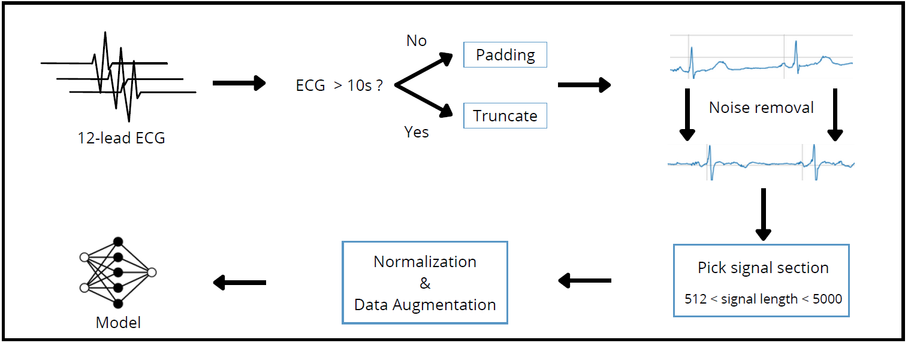
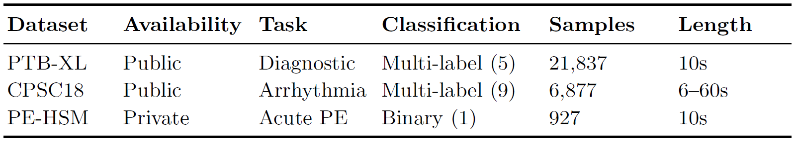

# Are ECGs enough? 🫀
This repository presents the original implementation of the paper [Are ECGs enough? Deep learning classification of cardiac anomalies using only electrocardiograms](https://doi.org/10.48550/arXiv.2503.08960) by João D.S. Marques and Arlindo Oliveira.

## Overview 📚
When we face a new problem related to anomaly cardiac detection, there are multiple questions related to the choice of the best networks, the minimum size of a dataset, what results to expect from a setting, what is the best signal length and normalization... In this study, we try to address some of these questions, while demonstrating that transfer learning is very useful in small imbalanced dataset settings. We investigate the performance of multiple neural network architectures in order to assess the impact of various approaches. Moreover, we check whether these practices enhance model generalization when transfer learning is used by pre-training in PTB-XL and CPSC18 and demonstrating our results through a smaller, more challenging dataset for pulmonary embolism (PE) detection. By leveraging transfer learning, we analyze the extent to which we can improve learning efficiency and predictive performance on limited data. 

## Pipeline 🧪

The pipeline follows the settings in `hyperparameters.yml`: 
- `pre_process`: denoising/preprocessing 'default' (wavelet decomposition with low pass filter), 'bandpass' or 'none';
- `norm`: normalization can be 'none', 'minmax', 'zscore', 'rscal', 'logscal' or 'l2';
- `Model`: You can choose a family `model_type` (e.g 'vgg') and a `submodel` (e.g. '16').
- `n_leads`: Number of leads your data has (e.g. '12')
- `ecg_len`: Length of the signal you want to pick
- `max_ecg_len`: the length all the signals must have.
- `data_aug`: `True` if you want to apply data augmentation, `False` otherwise.



## Datasets 📝

We use 3 datasets for this research [PTB-XL](https://physionet.org/content/ptb-xl/1.0.3/), [CPSC-2018](http://2018.icbeb.org/Challenge.html) and [PE-HSM](https://doi.org/10.1016/j.repc.2023.03.016). you can run them by changing `dataset` parameter to 'ptbxl', 'cpsc18' or 'hsm'.




Although the paper did not explore the PTB-XL dataset for the sub-class, form or rhythm problems, you can run this code for those tasks by setting the `set` to either 'diagnostic', 'form' or 'rhythm' and the `subset` to 'superclass', 'subclass' or 'all'. Note that the `subset` is only used for the diagnostic problem, not for `rhythm` or `form`.
## How to run 💻

You need to define your hyperparameters.yml, paste the correspondent path in the script and should run `python ecg_classification_main.py`. Scripts with optuna and wandb tags are variants of this file for running with [WandB](https://wandb.ai) or [Optuna](https://optuna.org/).

The file `utils.py` contains all the auxiliar code.

## Citation 💬
If you find this work useful, please consider citing our paper:

```bibtex
@misc{AreECGsEnough,
      title={Are ECGs enough? Deep learning classification of cardiac anomalies using only electrocardiograms}, 
      author={Joao D. S. Marques and Arlindo L. Oliveira},
      year={2025},
      eprint={2503.08960},
      archivePrefix={arXiv},
      primaryClass={cs.CV},
      url={https://arxiv.org/abs/2503.08960}, 
}
```


