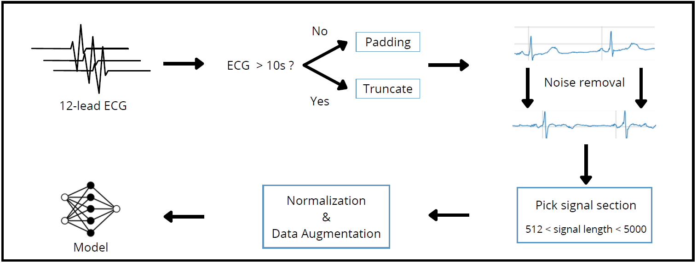
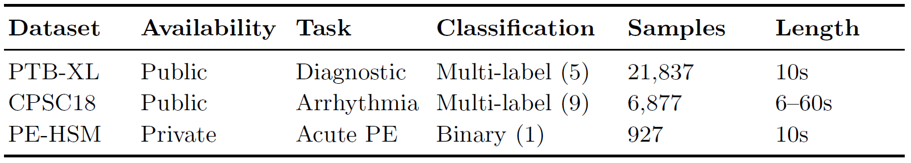

# Are ECGs enough? 🫀
This repository presents the original implementation of the paper [Are ECGs enough? Deep learning classification of pulmonary embolism using electrocardiograms](https://doi.org/10.48550/arXiv.2503.08960) by João D.S. Marques and Arlindo Oliveira.

## Overview 📚
Pulmonary embolism is a leading cause of out of hospital cardiac arrest that requires fast diagnosis. While computed tomography pulmonary angiography is the standard diagnostic tool, it is not always accessible. Electrocardiography is an essential tool for diagnosing multiple cardiac anomalies, as it is affordable, fast and available in many settings. However, the availability of public ECG datasets, specially for PE, is limited and, in practice, these datasets tend to be small, making it essential to optimize learning strategies. In this study, we investigate the performance of multiple neural networks in order to assess the impact of various approaches. Moreover, we check whether these practices enhance model generalization when transfer learning is used to translate information learned in larger ECG datasets, such as PTB-XL, CPSC18 and MedalCare-XL, to a smaller, more challenging dataset for PE. By leveraging transfer learning, we analyze the extent to which we can improve learning efficiency and predictive performance on limited data.

## Pipeline 🧪

The pipeline follows the settings in `hyperparameters.yml`: 
- `pre_process`: denoising/preprocessing 'default' (wavelet decomposition with low pass filter), 'bandpass' or 'none';
- `norm`: normalization can be 'none', 'minmax', 'zscore', 'rscal', 'logscal' or 'l2';
- `Model`: You can choose a family `model_type` (e.g 'vgg') and a `submodel` (e.g. '16').
- `n_leads`: Number of leads your data has (e.g. '12')
- `ecg_len`: Length of the signal you want to pick
- `max_ecg_len`: the length all the signals must have.
- `data_aug`: `True` if you want to apply data augmentation, `False` otherwise.



## Datasets 📝

We use 4 datasets for this research [PTB-XL](https://physionet.org/content/ptb-xl/1.0.3/), [CPSC-2018](http://2018.icbeb.org/Challenge.html), [MedalCare-XL](https://www.nature.com/articles/s41597-023-02416-4) and [PE-HSM](https://doi.org/10.1016/j.repc.2023.03.016). you can run them by changing `dataset` parameter to 'ptbxl', 'cpsc18', 'medalcare' or 'hsm'.




Although the paper did not explore the PTB-XL dataset for the sub-class, form or rhythm problems, you can run this code for those tasks by setting the `set` to either 'diagnostic', 'form' or 'rhythm' and the `subset` to 'superclass', 'subclass' or 'all'. Note that the `subset` is only used for the diagnostic problem, not for `rhythm` or `form`.
## How to run 💻

You need to define your hyperparameters.yml, paste the correspondent path in the script and should run `python ecg_classification_main.py`. Scripts with optuna and pretrain tags are variants of this file for running with pretrained versions (given the path of a .pth) or [Optuna](https://optuna.org/). To use [WandB](https://wandb.ai) , you can run the main file with the `--wandb` flag:

```bash
python3 ecg_classification_main.py --wandb
Note: Make sure to add your Weights & Biases (wandb) API key in the main code or configure it using wandb login.
The file `utils.py` contains all the auxiliar code.

## Citation 💬
If you find this work useful, please consider citing our paper:

```bibtex
@misc{marques_are_ecgs_enough_2025,
      title={Are ECGs enough? Deep learning classification of pulmonary embolism using electrocardiograms}, 
      author={Joao D. S. Marques and Arlindo L. Oliveira},
      year={2025},
      eprint={2503.08960},
      archivePrefix={arXiv},
      primaryClass={cs.CV},
      url={https://arxiv.org/abs/2503.08960}, 
}
```


